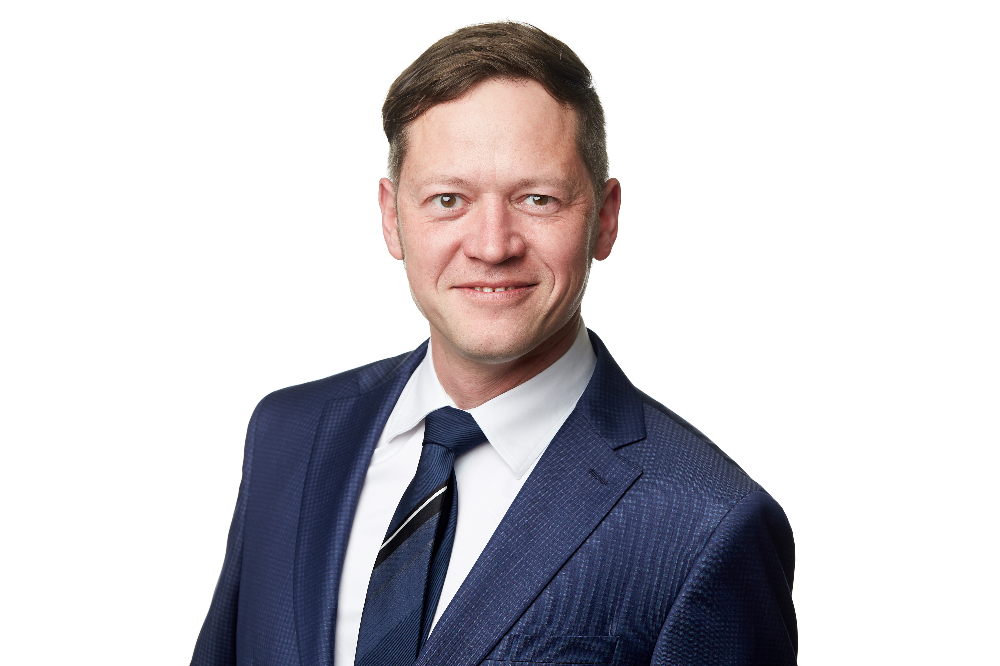

+++
date = '2026-04-29T09:17:01+02:00'
draft = false
title = 'Lebenslauf'
menu = 'Lebenslauf'
+++

**Gordon Wiegand** 
<small>Dr. phil.</small>
> Gummenacher 4A 
> 2562 Port 
> 079 883 81 76 
> gordon.wiegand@mailbox.org

`Geburtstag`: 7. Aug 1975 
`Nationalitäten`: Schweiz und Deutschland 

 <small>download [vCard](gw.vcf)</small>  
 <small>download [CV](cv_gw_de.pdf) Deutsch</small>  
 <small>download [CV](cv_gw_en.pdf) English</small> 

---

Ich habe in unterschiedlichen Bereichen gearbeitet, aber letztendlich drehte sich doch immer alles um Zahlen. Ich habe sie aus den spannendsten Perspektiven betrachtet. In der Lehre, in der Forschung, in der Analyse, in der Kommunikation, in der Anwendung, für das Management, als das Management, in der Entstehung, in der Verarbeitung, im Transport, in der Darstellung, in der Organisation.

