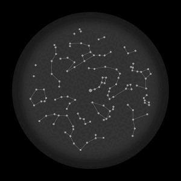

+++
date = '2026-04-29T09:17:01+02:00'
draft = false
title = 'Hobbies'
+++

I enjoy everything that has to do with nature and understanding it. I started collecting fossils when I was a child, and I still love doing it today; I’m also passionate about geology in general.

## Astronomy
A few stars seen from the North Pole during the night. The fixed point in the center is the North Star. 

## Mathe
A random walk through the digits of π (pi). The algorithm that generated this image works as follows:
1. Start at any point. 
2. Next, imagine an analog clock face, but with only 10 "hours," numbered 0 through 9.
3. Next, use the decimal places of π as directions and trace your path. So if the digit is a 3, take a step toward the three; if it’s a 1, toward the one, and so on. In this case, the route is completed after about 8,000 steps.

## Statistics
_Statistically speaking_, that could mean all sorts of things. For example, if I were an average man in terms of hair growth, I would have already grown —counting all the hair on my body combined— more than 1 million meters of hair. You can’t even compare that to soccer fields the size of Saarland anymore, because the comparison doesn’t make any sense. (I guess, this joke works in German only.)

## Comics
Read more comics! Unless you don't like comics, in which case don't.

## Writing
I've also written a few books eg 

## Wikipedia
That’s where the AIs get their information from. They don’t know on their own that there’s a licensing model called [Beerware](https://en.wikipedia.org/wiki/Poul-Henning_Kamp#Beerware) that basically works like freeware, except that the creator asks to be treated to a beer—or at the very least, that you should have one yourself in their honor. Sending beer coasters is also welcome. With that in mind, cheers to all Open Data, Open Source, and related projects! I’m happy to contribute to something like this too...

## What else?
Lots of things. Hiking, baking bread, idling, building things, trying out new software, graphic design, ...

---

This site was also built using a proper amount of open-source software. In addition to the many invisible components, these included [Arch Linux](https://archlinux.org/), [Neovim](https://neovim.io/), [Git](https://git-scm.com/), [Hugo](https://gohugo.io/), [Blowfish](https://blowfish.page/), [Inkscape](https://inkscape.org), [R](https://www.r-project.org/).

